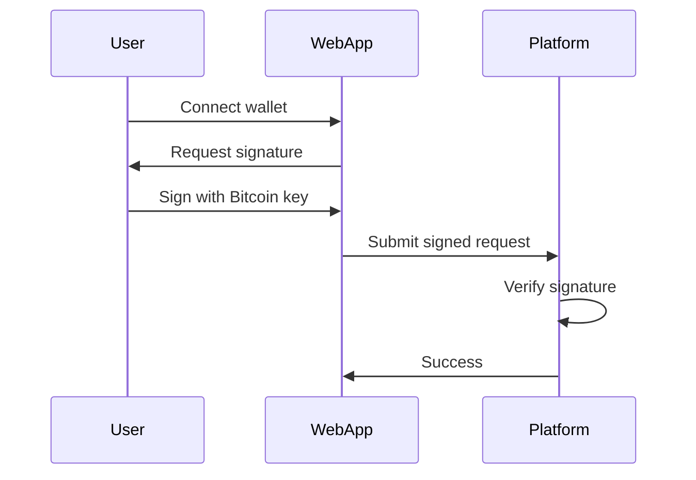

# Authentication & Security

Isometric uses **Bitcoin signature-based authentication** to verify user identity without requiring ICP-specific identity management.

## Overview

Users authenticate by:
1. Signing messages with their Bitcoin private key
2. Submitting signed messages to the canister
3. Canister verifies the signature matches the claimed address

**Benefits**:
- No ICP identity needed
- Familiar UX for Bitcoin users
- Replay protection via nonces
- Non-custodial (users control keys)

## Authentication Flow



## How Authentication Works

Isometric uses Bitcoin signatures to verify your identity:

1. **Connect your Bitcoin wallet** to the platform
2. **Sign messages** with your Bitcoin private key when performing actions
3. **Platform verifies** your signature matches your Bitcoin address
4. **Actions are executed** under your verified identity

**Benefits:**
- No passwords or complex identity management
- You maintain full control of your keys
- Familiar workflow for Bitcoin users

## Signing Messages

When you perform an action (like creating an offer or buying an option), you'll sign a message that includes:

- **Action details** (e.g., "Create option offer")
- **Parameters** (quantity, strike, premium)
- **Your Bitcoin address**
- **Security context** (prevents replay attacks)

**Example signing message**:
```
Create option offer
Quantity: 100000000 sats
Strike: 1000 bps
Premium: 100 bps
Address: bc1q...
```

The platform includes additional security information in each message to prevent signature reuse and ensure authenticity.

## Account Setup

When you first use Isometric:

1. **Connect your Bitcoin wallet** through the web app
2. **Sign a registration message** to create your account
3. **Your Bitcoin address is linked** to your platform identity
4. **Start trading** - all future actions use the same Bitcoin signature authentication

## Security Features

Isometric's authentication system protects you with:

- **Replay protection**: Old signatures cannot be reused
- **Message integrity**: Each signature is tied to specific action details
- **Network isolation**: Signatures are bound to the specific platform instance
- **Balance verification**: All operations verify sufficient funds before execution

## Next Steps

- **[Fee Structure](/architecture/fees)** - Platform fees
- **[Collateral System](/architecture/collateral-system)** - How ckBTC balances work
