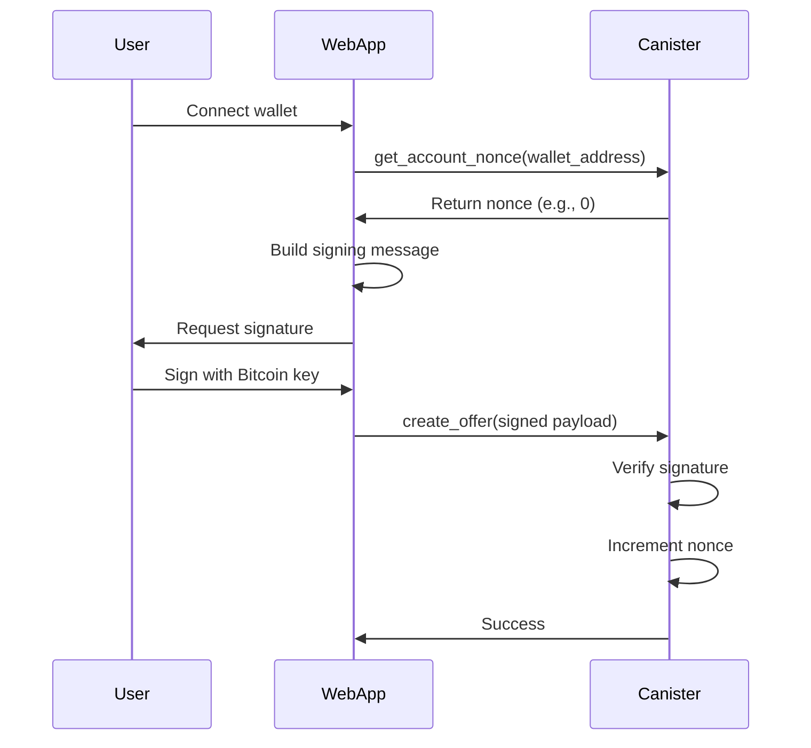

# Authentication & Security

Isometric uses **Bitcoin signature-based authentication** to verify user identity without requiring ICP-specific identity management.

## Overview

Users authenticate by:
1. Signing messages with their Bitcoin private key
2. Submitting signed messages to the canister
3. Canister verifies the signature matches the claimed address

**Benefits**:
- No ICP identity needed
- Familiar UX for Bitcoin users
- Replay protection via nonces
- Non-custodial (users control keys)

## Authentication Flow



## Signing Messages

### Challenge Context

Every signed message includes a **challenge context**:

```rust
pub struct ChallengeContext {
    pub canister_id: String,
    pub network: String,
    pub nonce: u64,
}
```

**Example**:
```
Create option offer
Quantity: 100000000 sats
Strike: 1000 bps
Premium: 100 bps
Address: bc1q...
Canister: bkyz2-fmaaa-aaaaa-qaaaq-cai
Network: ic
Nonce: 5
```

### Nonce-Based Replay Protection

Each user has a **nonce** that increments with every signed action:

```rust
pub fn get_account_nonce(wallet_address: String) -> u64 {
    let wallet_key = WalletKey::from_address(&wallet_address);
    ACCOUNT_NONCES.with(|nonces| {
        nonces.borrow().get(&wallet_key).unwrap_or(0)
    })
}

pub fn increment_nonce(wallet_key: &WalletKey) {
    ACCOUNT_NONCES.with(|nonces| {
        let current = nonces.borrow().get(wallet_key).unwrap_or(0);
        nonces.borrow_mut().insert(wallet_key.clone(), current + 1);
    });
}
```

**Why nonces?**
- Prevents replay attacks (old signatures can't be reused)
- Ensures message freshness
- Simple and effective

## Signature Verification

### BTC Signature Verification

```rust
pub fn verify_btc_signature(
    address: &str,
    message: &str,
    signature: &str,
) -> Result<()> {
    // Decode signature from base64
    let sig_bytes = base64::decode(signature)
        .map_err(|_| IsometricError::invalid_signature())?;
    
    // Verify signature matches address
    let is_valid = bitcoin::verify_message(address, message, &sig_bytes)?;
    
    if !is_valid {
        return Err(IsometricError::invalid_signature());
    }
    
    Ok(())
}
```

### Authenticated Payload

All authenticated endpoints accept an `AuthenticatedPayload`:

```rust
pub struct AuthenticatedPayload<T> {
    pub wallet_proof: WalletProof,
    pub data: T,
}

pub struct WalletProof {
    pub address: String,
    pub signature: String,
}
```

**Example**:
```json
{
  "wallet_proof": {
    "address": "bc1q...",
    "signature": "H8fG7d..."
  },
  "data": {
    "asset": "CkBtc",
    "option_type": "Call",
    "strike_basis_points": 1000,
    "premium_basis_points": 100,
    "quantity": 100000000
  }
}
```

## Wallet-to-Principal Mapping

### Account Registration

When a user creates an account:

```rust
pub async fn create_account(
    req: AuthenticatedPayload<CreateProfileRequest>
) -> Result<UserInfo> {
    // Verify signature
    verify_btc_signature(...)?;
    
    // Get caller principal
    let principal = ic_cdk::caller();
    
    // Map wallet to principal
    let wallet_key = WalletKey::from_address(&req.wallet_proof.address);
    WALLET_TO_PRINCIPAL.with(|map| {
        map.borrow_mut().insert(wallet_key.clone(), principal);
    });
    
    // Initialize nonce
    ACCOUNT_NONCES.with(|nonces| {
        nonces.borrow_mut().insert(wallet_key, 0);
    });
    
    Ok(user_info)
}
```

### Lookup Principal

For subsequent calls:

```rust
pub fn get_principal_for_wallet(wallet_key: &WalletKey) -> Option<Principal> {
    WALLET_TO_PRINCIPAL.with(|map| {
        map.borrow().get(wallet_key).copied()
    })
}
```

## Whitelisting

### Beta Access Control

During beta, the platform can restrict access via whitelisting:

```rust
pub async fn is_whitelisted() -> Result<()> {
    let caller = ic_cdk::caller();
    
    if !Config::is_whitelisting_enabled() {
        return Ok(()); // Whitelisting disabled, allow all
    }
    
    WHITELIST.with(|whitelist| {
        if whitelist.borrow().contains(&caller) {
            Ok(())
        } else {
            Err(IsometricError::not_whitelisted())
        }
    })
}
```

### Managing Whitelist

Admins can add/remove principals:

```bash
# Add to whitelist
dfx canister call isometric_dev add_whitelisted --network ic '(principal "xxxxx-xxxxx-xxxxx-xxxxx-cai")'

# Remove from whitelist
dfx canister call isometric_dev remove_whitelisted --network ic '(principal "xxxxx-xxxxx-xxxxx-xxxxx-cai")'

# List whitelisted
dfx canister call isometric_dev list_whitelisted --network ic
```

## Security Considerations

### Signature Replay Prevention

- **Nonces**: Increment after every action
- **Challenge context**: Includes canister ID and network
- **Message uniqueness**: Each action has unique message content

### Reentrancy Protection

Operations use locks to prevent concurrent execution:

```rust
pub struct AcceptLock {
    principal: Principal,
}

impl AcceptLock {
    pub fn new(principal: Principal) -> Result<Self> {
        if is_locked(principal) {
            return Err(IsometricError::operation_in_progress());
        }
        set_locked(principal, true);
        Ok(Self { principal })
    }
}

impl Drop for AcceptLock {
    fn drop(&mut self) {
        set_locked(self.principal, false);
    }
}
```

### Balance Verification

All operations verify balances before execution:

```rust
// Check writer has sufficient balance
let balance = get_balance(&writer);
if balance.available < quantity {
    return Err(IsometricError::insufficient_balance(...));
}
```

### Controller-Only Endpoints

Admin functions are restricted to canister controllers:

```rust
pub async fn is_controller() -> Result<()> {
    let caller = ic_cdk::caller();
    let controllers = ic_cdk::api::canister_controllers();
    
    if controllers.contains(&caller) {
        Ok(())
    } else {
        Err(IsometricError::unauthorized())
    }
}
```

## Next Steps

- **[Fee Structure](/architecture/fees)** - Platform fees
- **[Collateral System](/architecture/collateral-system)** - How ckBTC balances work
