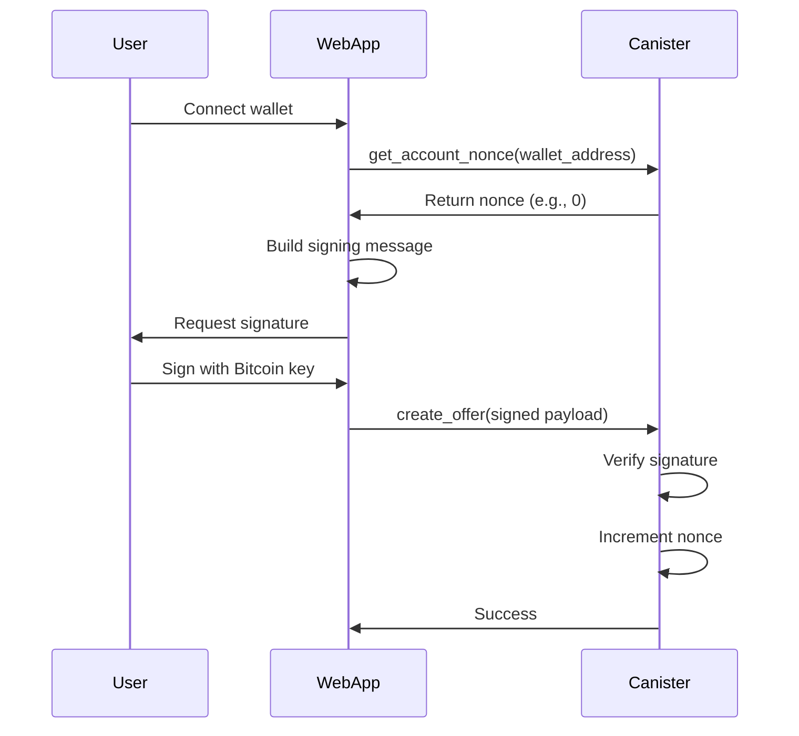

# Authentication & Security

Isometric uses **Bitcoin signature-based authentication** to verify user identity without requiring ICP-specific identity management.

## Overview

Users authenticate by:
1. Signing messages with their Bitcoin private key
2. Submitting signed messages to the canister
3. Canister verifies the signature matches the claimed address

**Benefits**:
- No ICP identity needed
- Familiar UX for Bitcoin users
- Replay protection via nonces
- Non-custodial (users control keys)

## Authentication Flow



## Signing Messages

### Challenge Context

Every signed message includes a **challenge context** with:
- Canister ID (prevents cross-canister replay)
- Network identifier (prevents testnet/mainnet replay)
- Nonce (prevents signature reuse)

**Example signing message**:
```
Create option offer
Quantity: 100000000 sats
Strike: 1000 bps
Premium: 100 bps
Address: bc1q...
Canister: bkyz2-fmaaa-aaaaa-qaaaq-cai
Network: ic
Nonce: 5
```

### Nonce-Based Replay Protection

Each user has a **nonce** that increments with every signed action.

**How it works**:
1. User requests current nonce from canister
2. User signs message including that nonce
3. Canister verifies signature and nonce matches expected value
4. Canister increments nonce after successful verification

**Why nonces?**
- Prevents replay attacks (old signatures can't be reused)
- Ensures message freshness
- Simple and effective

## Signature Verification

### BTC Signature Verification

The platform verifies Bitcoin signatures using standard Bitcoin message signing:

1. Signature is decoded from base64 format
2. Cryptographic verification confirms the signature was created by the private key corresponding to the claimed address
3. If verification fails, the request is rejected

### Authenticated Payload

All authenticated endpoints require:
- **Wallet proof**: Bitcoin address and signature
- **Request data**: The actual operation parameters

**Example payload structure**:
```json
{
  "wallet_proof": {
    "address": "bc1q...",
    "signature": "H8fG7d..."
  },
  "data": {
    "asset": "CkBtc",
    "option_type": "Call",
    "strike_basis_points": 1000,
    "premium_basis_points": 100,
    "quantity": 100000000
  }
}
```

## Wallet-to-Principal Mapping

### Account Registration

When a user creates an account:

1. User signs a registration message with their Bitcoin wallet
2. Platform verifies the signature
3. Platform maps the Bitcoin address to the user's ICP principal
4. Nonce is initialized to 0 for the new account

This creates a permanent link between the Bitcoin address and the ICP identity.

### Subsequent Authentication

For all future operations:
1. User signs messages with their Bitcoin wallet
2. Platform looks up the associated principal
3. Operations are executed under that principal's identity

## Whitelisting

### Beta Access Control

During beta, the platform can restrict access via whitelisting:

- When enabled, only whitelisted principals can use the platform
- When disabled, all users with valid Bitcoin signatures can access the platform
- Whitelisting is configurable by platform administrators

### Managing Access

Platform administrators can:
- Add principals to the whitelist
- Remove principals from the whitelist
- View all whitelisted principals
- Enable/disable whitelisting globally

## Security Considerations

### Signature Replay Prevention

- **Nonces**: Increment after every action to prevent signature reuse
- **Challenge context**: Includes canister ID and network to prevent cross-context attacks
- **Message uniqueness**: Each action type has distinct message format

### Reentrancy Protection

The platform prevents concurrent operations on the same account:
- Operations acquire locks before execution
- Locks are automatically released when operations complete
- Concurrent attempts are rejected with "operation in progress" errors

### Balance Verification

All operations verify sufficient balance before execution:
- Writers must have available collateral before creating offers
- Buyers must have sufficient balance for premiums
- Withdrawals check available (non-locked) balance

### Administrative Access Control

Sensitive platform operations are restricted:
- Only canister controllers can execute admin functions
- Configuration changes require controller authorization
- Regular users cannot access administrative endpoints

## Next Steps

- **[Fee Structure](/architecture/fees)** - Platform fees
- **[Collateral System](/architecture/collateral-system)** - How ckBTC balances work
