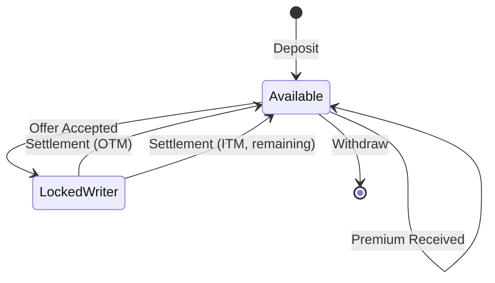

# Collateral System

Isometric uses **ckBTC** (chain-key Bitcoin) for all collateral, premiums, and payouts. This document explains how the collateral system works.

## What is ckBTC?

**ckBTC** is a 1:1 Bitcoin-backed token on the Internet Computer Protocol (ICP).

- **1:1 backed**: Each ckBTC is backed by real BTC held in a decentralized custody system
- **Fast**: Transactions settle in ~2 seconds
- **Low fees**: Minimal transfer costs (~0.0000001 BTC per transfer)
- **Decentralized**: No single custodian controls the BTC
- **Redeemable**: Always convertible back to real BTC

Learn more: [ckBTC Documentation](https://internetcomputer.org/current/developer-docs/integrations/bitcoin/ckbtc)

## User Subaccounts

Each Isometric user has a **unique subaccount** within the Isometric canister.

### How Subaccounts Work

```
ckBTC Ledger
  └── Isometric Canister (owner)
        ├── User A Subaccount (derived from Principal A)
        ├── User B Subaccount (derived from Principal B)
        └── User C Subaccount (derived from Principal C)
```

**Key Points**:
- Subaccounts are **derived deterministically** from user principals
- Each subaccount is **isolated** - users cannot access each other's funds
- The canister can transfer between subaccounts **instantly** (no blockchain transaction)
- External transfers (deposits/withdrawals) require blockchain transactions

### Subaccount Derivation

Each user's subaccount is derived deterministically from their ICP principal using cryptographic hashing.

This ensures:
- **Deterministic**: Same principal always gets same subaccount
- **Unique**: Different principals get different subaccounts
- **Secure**: Cannot be guessed or collided

## Balance States

User balances are tracked in **three states**:

### 1. Available Balance

Funds you can use immediately for:
- Writing new options
- Buying new options
- Withdrawing to external wallet

### 2. Locked as Writer

Funds locked as collateral for options you've **written**.

- Locked when a buyer accepts your offer
- Cannot be withdrawn
- Unlocked at settlement (minus any payout if ITM)

### 3. Locked as Buyer

Funds locked for options you've **bought** (rare, since premiums are paid upfront).

- Typically zero for buyers
- May be used for future features (e.g., early closing)

### Balance Transitions



## Deposit Flow

### Step 1: Get Deposit Address

User requests their unique deposit address from the platform.

The platform generates a Bitcoin address that:
- Is unique to the user
- Routes deposits to the user's ckBTC subaccount
- Can be used multiple times for deposits

### Step 2: Send BTC

User sends BTC from external wallet to this address.

### Step 3: ckBTC Minting

The ckBTC minter canister:
1. Detects the BTC deposit (monitors Bitcoin blockchain)
2. Waits for confirmations (typically 6)
3. Mints equivalent ckBTC to the user's subaccount

### Step 4: Update Balance

User requests a balance update to sync their internal balance with the ckBTC ledger:

1. Platform queries the ckBTC ledger for the user's subaccount balance
2. Internal balance tracking is updated to match
3. User can now use the deposited funds for trading

## Withdrawal Flow

### Step 1: Request Withdrawal

User requests to withdraw ckBTC to an external Bitcoin address:

1. Platform verifies the user's signature
2. Checks that sufficient available (non-locked) balance exists
3. Creates a pending withdrawal record
4. Deducts the amount from available balance

### Step 2: Process Withdrawal

A background process handles pending withdrawals:

1. Transfers ckBTC from user's subaccount to the ckBTC minter
2. Requests BTC redemption to the user's specified address
3. Marks withdrawal as complete

### Step 3: BTC Redemption

The ckBTC minter:
1. Burns the ckBTC
2. Sends equivalent BTC to the user's address
3. Waits for Bitcoin network confirmation

## Collateral Locking

When a buyer accepts an offer, the writer's collateral is locked.

### Lock Process

The platform atomically:
1. Verifies writer has sufficient available balance
2. Moves funds from "available" to "locked as writer" state
3. If insufficient balance, the entire operation fails

**Key Points**:
- Atomic operation (all-or-nothing)
- Fails if insufficient available balance
- Locked funds cannot be withdrawn

### Unlock Process (Settlement)

At settlement, the platform:

**If Out-of-the-Money**:
- Unlocks full collateral
- Returns all funds to writer's available balance

**If In-the-Money**:
- Calculates payout to buyer
- Transfers payout from locked collateral
- Returns remaining collateral to writer

## Premium Transfers

When a buyer accepts an offer, the premium is transferred immediately.

### Transfer Flow

The platform executes on-chain ckBTC transfers:

1. **Premium to writer**: Transfers premium (minus platform fee) from buyer's subaccount to writer's subaccount
2. **Fee to platform**: Transfers platform fee from buyer's subaccount to platform fee recipient

**Key Points**:
- Premium is paid **upfront** (not at settlement)
- Writer receives premium immediately (minus platform fee)
- Transfers are **on-chain** (ckBTC ledger transactions)

## Internal Accounting

The canister maintains internal balance tracking for efficiency.

### Why Internal Accounting?

- **Fast queries**: No need to query ckBTC ledger for every balance check
- **Atomic operations**: Lock/unlock without blockchain transactions
- **Event logging**: Track all balance changes for auditing

### Reconciliation

The platform can verify internal balances match the ckBTC ledger:

1. Query actual ckBTC balance from ledger
2. Calculate expected balance (available + locked_as_writer + locked_as_buyer)
3. Compare and log any discrepancies for investigation

## Security Considerations

### Reentrancy Protection

All balance operations use locks to prevent concurrent modifications:
- Operations acquire locks before modifying balances
- Locks are automatically released when operations complete
- Prevents race conditions and double-spending

### Balance Checks

All operations verify balances **before** execution:
- Offers: Check writer has sufficient available balance
- Accepts: Check buyer has sufficient available balance for premium
- Withdrawals: Check user has sufficient available balance

### Rollback on Failure

If any step fails during accept or settlement, state is rolled back:
- Collateral locks are reversed
- Balance changes are undone
- Ensures consistency even if operations fail mid-execution

## Next Steps

- **[Contract Standardization](/architecture/contract-standardization)** - How offers are structured
- **[Settlement Process](/architecture/settlement)** - Automatic settlement details
- **[Fee Structure](/architecture/fees)** - Platform fees
