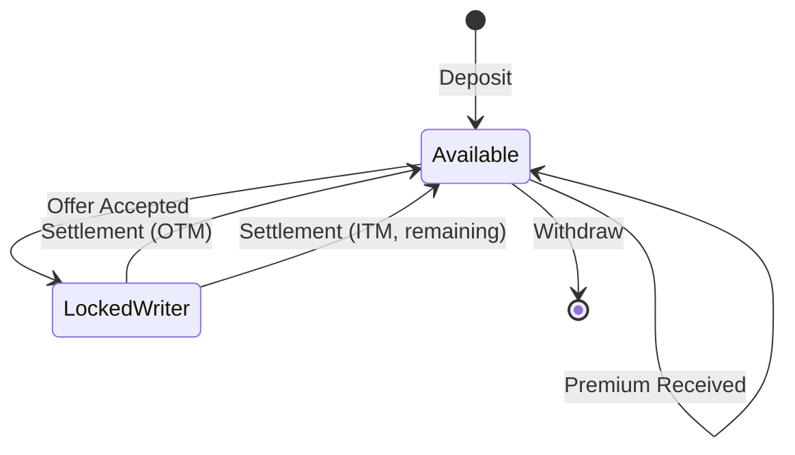

# Collateral System

Isometric uses **ckBTC** (chain-key Bitcoin) for all collateral, premiums, and payouts. This document explains how the collateral system works.

## What is ckBTC?

**ckBTC** is a 1:1 Bitcoin-backed token on the Internet Computer Protocol (ICP).

- **1:1 backed**: Each ckBTC is backed by real BTC held in a decentralized custody system
- **Fast**: Transactions settle in ~2 seconds
- **Low fees**: Minimal transfer costs (~0.0000001 BTC per transfer)
- **Decentralized**: No single custodian controls the BTC
- **Redeemable**: Always convertible back to real BTC

Learn more: [ckBTC Documentation](https://internetcomputer.org/current/developer-docs/integrations/bitcoin/ckbtc)

## User Subaccounts

Each Isometric user has a **unique subaccount** within the Isometric canister.

### How Subaccounts Work

```
ckBTC Ledger
  └── Isometric Canister (owner)
        ├── User A Subaccount (derived from Principal A)
        ├── User B Subaccount (derived from Principal B)
        └── User C Subaccount (derived from Principal C)
```

**Key Points**:
- Subaccounts are **derived deterministically** from user principals
- Each subaccount is **isolated** - users cannot access each other's funds
- The canister can transfer between subaccounts **instantly** (no blockchain transaction)
- External transfers (deposits/withdrawals) require blockchain transactions

### Subaccount Derivation

```rust
fn derive_subaccount(principal: Principal) -> [u8; 32] {
    let mut hasher = Sha256::new();
    hasher.update(b"isometric-subaccount");
    hasher.update(principal.as_slice());
    hasher.finalize().into()
}
```

This ensures:
- **Deterministic**: Same principal always gets same subaccount
- **Unique**: Different principals get different subaccounts
- **Secure**: Cannot be guessed or collided

## Balance States

User balances are tracked in **three states**:

### 1. Available Balance

Funds you can use immediately for:
- Writing new options
- Buying new options
- Withdrawing to external wallet

### 2. Locked as Writer

Funds locked as collateral for options you've **written**.

- Locked when a buyer accepts your offer
- Cannot be withdrawn
- Unlocked at settlement (minus any payout if ITM)

### 3. Locked as Buyer

Funds locked for options you've **bought** (rare, since premiums are paid upfront).

- Typically zero for buyers
- May be used for future features (e.g., early closing)

### Balance Transitions



## Deposit Flow

### Step 1: Get Deposit Address

User calls `get_deposit_address()`:

```rust
pub fn get_deposit_address(wallet_address: String) -> String {
    let principal = get_principal_for_wallet(&wallet_key)?;
    let subaccount = derive_subaccount(principal);
    
    // ckBTC minter canister address + user subaccount
    encode_btc_address(CKBTC_MINTER, subaccount)
}
```

This returns a **unique Bitcoin address** for the user.

### Step 2: Send BTC

User sends BTC from external wallet to this address.

### Step 3: ckBTC Minting

The ckBTC minter canister:
1. Detects the BTC deposit (monitors Bitcoin blockchain)
2. Waits for confirmations (typically 6)
3. Mints equivalent ckBTC to the user's subaccount

### Step 4: Update Balance

User calls `update_ckbtc_balance()`:

```rust
pub async fn update_ckbtc_balance(wallet_address: String) -> Result<u64> {
    let principal = get_principal_for_wallet(&wallet_key)?;
    let subaccount = derive_subaccount(principal);
    
    // Query ckBTC ledger for balance
    let balance = ckbtc_ledger.balance_of(canister_self(), subaccount).await?;
    
    // Update internal balance tracking
    update_user_balance(principal, balance);
    
    Ok(balance)
}
```

This syncs the internal balance with the ckBTC ledger.

## Withdrawal Flow

### Step 1: Request Withdrawal

User calls `withdraw_ckbtc(amount, btc_address)`:

```rust
pub async fn withdraw_ckbtc(
    req: AuthenticatedPayload<WithdrawCkbtcRequest>
) -> Result<WithdrawResult> {
    // Verify signature
    verify_btc_signature(...)?;
    
    // Check available balance
    let balance = get_balance(&principal);
    if balance.available < req.data.amount {
        return Err(InsufficientBalance);
    }
    
    // Create pending withdrawal
    let withdrawal = create_pending_withdrawal(principal, req.data.amount, req.data.address);
    
    // Deduct from available balance
    subtract_available(principal, req.data.amount)?;
    
    Ok(withdrawal)
}
```

### Step 2: Process Withdrawal

A background timer processes pending withdrawals:

```rust
async fn process_withdrawals() {
    for withdrawal in get_pending_withdrawals() {
        // Transfer ckBTC to ckBTC minter for redemption
        let result = ckbtc_ledger.transfer(
            from_subaccount: user_subaccount,
            to: ckbtc_minter_address,
            amount: withdrawal.amount,
        ).await;
        
        if result.is_ok() {
            // Request BTC redemption
            ckbtc_minter.retrieve_btc(withdrawal.btc_address, withdrawal.amount).await;
            mark_withdrawal_complete(withdrawal.id);
        }
    }
}
```

### Step 3: BTC Redemption

The ckBTC minter:
1. Burns the ckBTC
2. Sends equivalent BTC to the user's address
3. Waits for Bitcoin network confirmation

## Collateral Locking

When a buyer accepts an offer, the writer's collateral is locked.

### Lock Process

```rust
pub fn lock_collateral(writer: Principal, amount: u64) -> Result<()> {
    let mut balance = get_balance(&writer);
    
    // Check sufficient available balance
    if balance.available < amount {
        return Err(InsufficientBalance);
    }
    
    // Move from available to locked
    balance.available -= amount;
    balance.locked_as_writer += amount;
    
    update_balance(writer, balance);
    Ok(())
}
```

**Key Points**:
- Atomic operation (all-or-nothing)
- Fails if insufficient available balance
- Locked funds cannot be withdrawn

### Unlock Process (Settlement)

```rust
pub fn settle_option(option: ActiveOption, settlement_price: u64) -> Result<()> {
    if settlement_price > option.strike_price_cents {
        // ITM: Calculate payout
        let payout = calculate_payout(option.quantity, settlement_price, option.strike_price_cents);
        
        // Unlock writer collateral
        unlock_collateral(option.writer, option.quantity)?;
        
        // Transfer payout to buyer
        add_available(option.buyer, payout);
        
        // Return remaining to writer
        let remaining = option.quantity - payout;
        add_available(option.writer, remaining);
    } else {
        // OTM: Return full collateral to writer
        unlock_collateral(option.writer, option.quantity)?;
        add_available(option.writer, option.quantity);
    }
    
    Ok(())
}
```

## Premium Transfers

When a buyer accepts an offer, the premium is transferred immediately.

### Transfer Flow

```rust
pub async fn transfer_premium(
    buyer: Principal,
    writer: Principal,
    premium: u64,
    platform_fee: u64,
) -> Result<()> {
    let buyer_subaccount = derive_subaccount(buyer);
    let writer_subaccount = derive_subaccount(writer);
    
    // Transfer premium to writer (minus fee)
    ckbtc_ledger.transfer(
        from_subaccount: Some(buyer_subaccount),
        to: Account { owner: canister_self(), subaccount: Some(writer_subaccount) },
        amount: premium - platform_fee,
    ).await?;
    
    // Transfer fee to platform
    if platform_fee > 0 {
        ckbtc_ledger.transfer(
            from_subaccount: Some(buyer_subaccount),
            to: Account { owner: fee_recipient(), subaccount: None },
            amount: platform_fee,
        ).await?;
    }
    
    Ok(())
}
```

**Key Points**:
- Premium is paid **upfront** (not at settlement)
- Writer receives premium immediately (minus platform fee)
- Transfers are **on-chain** (ckBTC ledger transactions)

## Internal Accounting

The canister maintains internal balance tracking for efficiency.

### Why Internal Accounting?

- **Fast queries**: No need to query ckBTC ledger for every balance check
- **Atomic operations**: Lock/unlock without blockchain transactions
- **Event logging**: Track all balance changes for auditing

### Reconciliation

Periodically, the canister can reconcile internal balances with the ckBTC ledger:

```rust
pub async fn reconcile_balance(principal: Principal) -> Result<()> {
    let subaccount = derive_subaccount(principal);
    let ledger_balance = ckbtc_ledger.balance_of(canister_self(), subaccount).await?;
    let internal_balance = get_balance(&principal);
    
    let expected = internal_balance.available 
                 + internal_balance.locked_as_writer 
                 + internal_balance.locked_as_buyer;
    
    if ledger_balance != expected {
        // Log discrepancy for investigation
        log_balance_mismatch(principal, ledger_balance, expected);
    }
    
    Ok(())
}
```

## Security Considerations

### Reentrancy Protection

All balance operations use **locks** to prevent reentrancy:

```rust
pub struct AcceptLock {
    principal: Principal,
}

impl AcceptLock {
    pub fn new(principal: Principal) -> Result<Self> {
        if is_locked(principal) {
            return Err(OperationInProgress);
        }
        set_locked(principal, true);
        Ok(Self { principal })
    }
}

impl Drop for AcceptLock {
    fn drop(&mut self) {
        set_locked(self.principal, false);
    }
}
```

### Balance Checks

All operations verify balances **before** execution:

- Offers: Check writer has sufficient available balance
- Accepts: Check buyer has sufficient available balance for premium
- Withdrawals: Check user has sufficient available balance

### Rollback on Failure

If any step fails during accept or settlement, state is rolled back:

```rust
// Lock collateral
for offer in offers {
    lock_collateral(offer.writer, offer.quantity)?;
    locked_states.push(offer);
}

// Transfer premium
if transfer_premium(...).await.is_err() {
    // Rollback all locks
    for state in locked_states {
        unlock_collateral(state.writer, state.quantity);
    }
    return Err(TransferFailed);
}
```

## Next Steps

- **[Contract Standardization](/architecture/contract-standardization)** - How offers are structured
- **[Settlement Process](/architecture/settlement)** - Automatic settlement details
- **[Fee Structure](/architecture/fees)** - Platform fees
