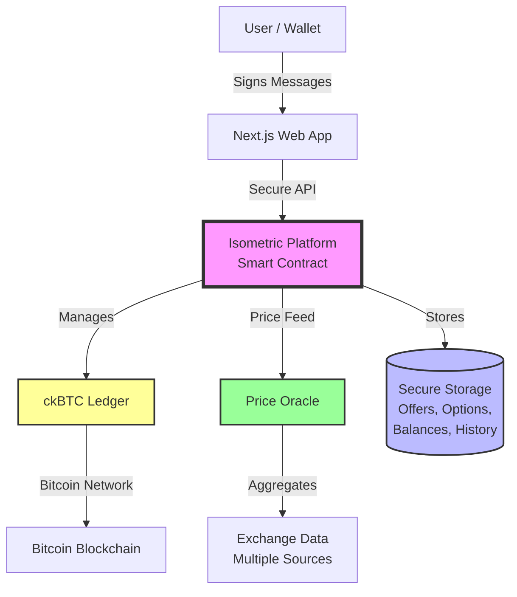
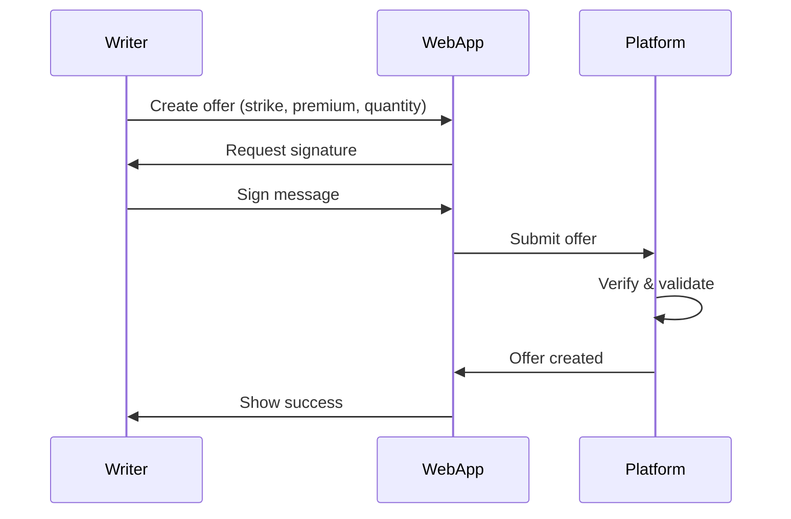
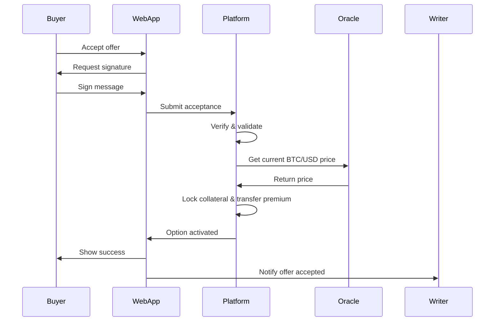
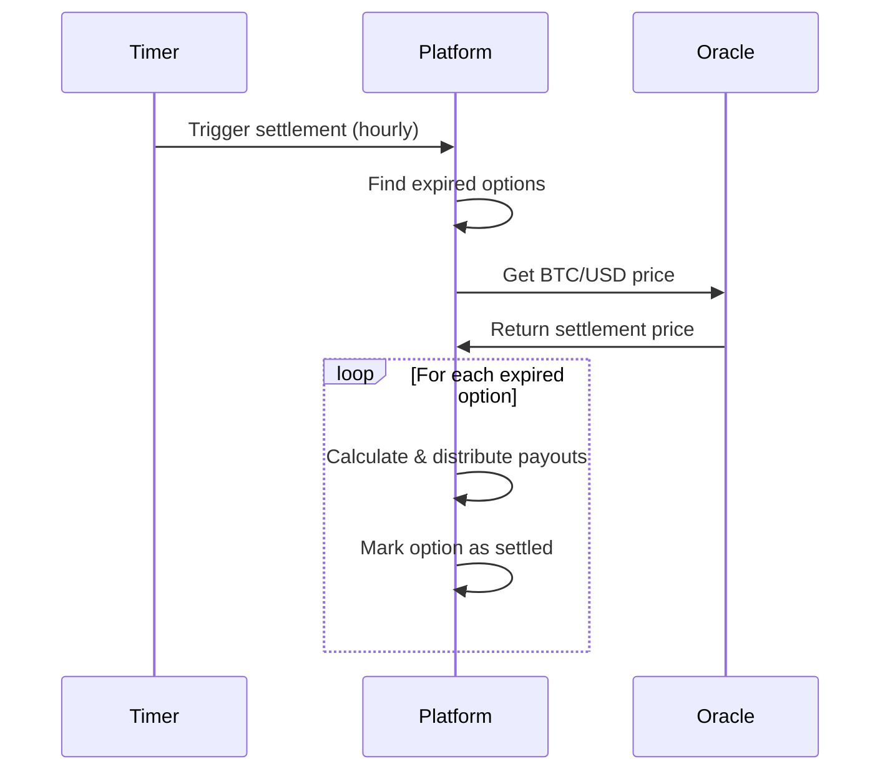

# System Architecture Overview

Isometric is built on the **Internet Computer Protocol (ICP)**, leveraging its unique capabilities for decentralized finance. This document provides a high-level overview of the system architecture.

## Architecture Diagram

## Core Components

### 1. Frontend (Next.js Web App)

**Technology**: Next.js, React, TypeScript, Shadcn UI

**Responsibilities**:
- User interface for trading options
- Wallet integration (Dynamic.xyz)
- Message signing for authentication
- Real-time price display
- Portfolio management UI

### 2. Backend (Smart Contract)

**Technology**: Secure smart contract on Internet Computer Protocol

**Responsibilities**:
- Core business logic (offers, options, settlement)
- User authentication and authorization
- Balance management (deposits, withdrawals, transfers)
- Transaction history and state management
- Automatic settlement

### 3. ckBTC Ledger

**What is ckBTC?**

ckBTC (chain-key Bitcoin) is a **1:1 backed** Bitcoin token on ICP. It's created by depositing real BTC into a decentralized custody system and minting equivalent ckBTC on ICP.

**Why ckBTC?**
- **Fast**: Transactions settle in seconds, not minutes
- **Low fees**: Minimal transfer costs compared to Bitcoin L1
- **Decentralized**: No centralized custodian
- **1:1 backed**: Always redeemable for real BTC

**How Isometric Uses ckBTC**:
- All collateral is held as ckBTC
- All premiums are paid in ckBTC
- All payouts are in ckBTC
- Users deposit BTC → receive ckBTC → trade → withdraw ckBTC → receive BTC

### 4. ICP Exchange Rate Canister (Oracle)

**Purpose**: Provides BTC/USD price feeds for settlement

**How It Works**:
- Aggregates data from multiple exchanges (Coinbase, Binance, etc.)
- Provides median price to reduce manipulation risk
- Updates frequently (every few minutes)
- Accessible to all ICP canisters

**Isometric Integration**:
- Fetches BTC/USD price when buyer accepts an offer (for strike locking)
- Fetches BTC/USD price at option expiry (for settlement)
- Used to calculate option values and payouts

**Learn more**: [ICP Exchange Rate Canister Docs](https://internetcomputer.org/current/developer-docs/integrations/exchange-rate-canister/)

## Data Flow

### Creating an Offer (Writer)

### Accepting an Offer (Buyer)

### Settlement at Expiry

## Key Design Decisions

### 1. Covered Calls Only (MVP)

**Why?**
- Eliminates liquidation risk (no margin calls)
- Simpler to implement and understand
- No need for complex risk management
- Writers always have sufficient collateral

**Future**: Add cash-settled puts (stablecoin collateral)

### 2. Standardized Contracts

**Why?**
- Creates liquidity (multiple writers can fill same strike/expiry)
- Simplifies UX (no free-form inputs)
- Enables partial fills and offer stitching
- Reduces fragmentation

**How**: Fixed grids for strikes, premiums, and expiries

### 3. Automatic Settlement

**Why?**
- No manual exercise needed (better UX)
- Eliminates risk of forgetting to exercise
- Ensures timely settlement
- Reduces gas costs (batch settlement)

**How**: Hourly timer checks for expired options and settles them

### 4. Signature-Based Authentication

**Why?**
- Simple user experience with Bitcoin wallets
- No additional identity management needed
- Familiar to Bitcoin users
- Secure signature verification

**How**: Users sign messages with their Bitcoin private key to prove ownership

### 5. Subaccount-Based Balances

**Why?**
- Each user has isolated funds
- Platform cannot access user funds without signed approval
- Efficient on-chain accounting
- Supports fast internal transfers

**How**: Each user gets a unique subaccount derived from their principal

## Security Model

### User Authentication

- **Bitcoin signatures**: Users prove ownership of their Bitcoin address
- **Replay protection**: Built-in protection against signature reuse
- **Message integrity**: Each signature is tied to specific actions

### Authorization

- **Access control**: Secure access management during beta phase
- **Balance verification**: All operations check sufficient funds before execution

### Collateral Safety

- **Protected balances**: Collateral cannot be withdrawn while options are active
- **Atomic operations**: Transactions are all-or-nothing (no partial failures)
- **Automatic rollback**: Failed operations don't leave accounts in inconsistent states

### Oracle Integrity

- **Decentralized pricing**: Oracle aggregates data from multiple sources
- **Manipulation resistance**: Median pricing reduces risk of price manipulation
- **Transparent**: Pricing methodology is clear and verifiable

## Scalability

### Current Limits

- **Offers per term**: Writers can create a limited number of offers per strike/expiry combination
- **Batch settlement**: Options settle in batches (hourly) to reduce costs
- **Partial fills**: Enabled to improve liquidity

### Future Optimizations

- **Sharding**: Split storage across multiple canisters
- **Off-chain indexing**: Use indexers for historical data queries
- **Layer 2**: Explore L2 solutions for high-frequency trading

## Next Steps

Dive deeper into specific components:

- **[Collateral System](/architecture/collateral-system)** - How ckBTC balances work
- **[Contract Standardization](/architecture/contract-standardization)** - Strike/premium grids
- **[Settlement Process](/architecture/settlement)** - Automatic settlement details
- **[Authentication](/architecture/authentication)** - BTC signature verification
- **[Fee Structure](/architecture/fees)** - Platform fees and economics
