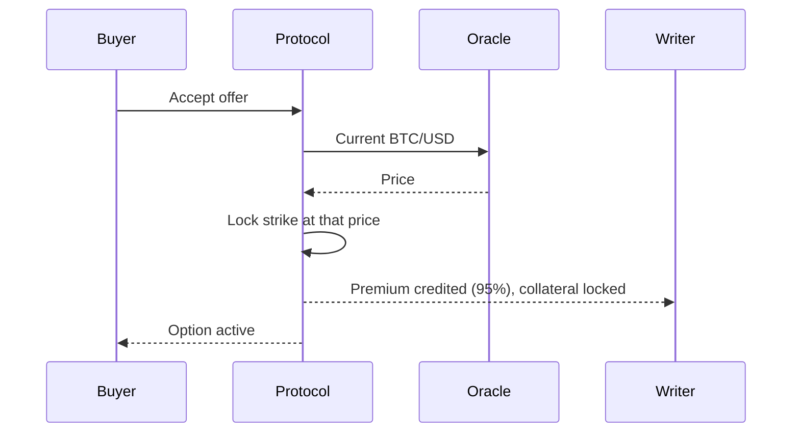
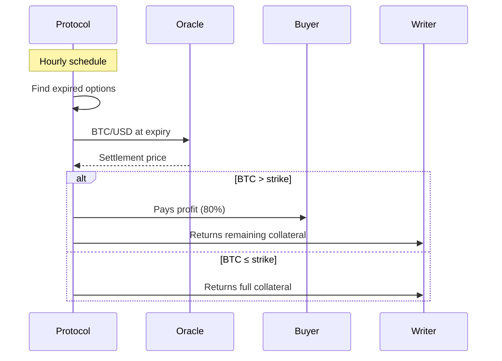

# Mechanics

How an option moves from offer to settlement.

## When an offer is accepted

When a buyer accepts a writer's offer, three things happen together:

- The buyer pays the premium.
- The writer receives 95% of the premium, credited to their available balance immediately.
- An equivalent amount of the writer's BTC is locked as collateral until expiry.

The strike, set as a percentage when the offer was created, is converted to a USD value at this moment using the current BTC/USD price. It is then fixed for the life of the option.

## Settlement

Settlement runs automatically on a fixed schedule. The protocol checks for expired options, fetches the BTC/USD price at expiry from the on-chain oracle, and pays out each side.

If a payout fails mid-flight, the protocol retries until it completes. Your balance is never at risk; the option remains backed by the same locked collateral until the transfer goes through.

## A note on Bitcoin custody

When you deposit, your BTC goes into custody held under threshold ECDSA. Internet Computer nodes sign Bitcoin transactions collectively, and no single node holds the key. The internal on-chain representation of that BTC is called ckBTC. From your perspective the balance behaves like native BTC: you deposit BTC and you withdraw BTC.

Verify on-chain: [ckBTC minter](https://dashboard.internetcomputer.org/canister/mqygn-kiaaa-aaaar-qaadq-cai), [ckBTC ledger](https://dashboard.internetcomputer.org/canister/mxzaz-hqaaa-aaaar-qaada-cai). Background: [ckBTC docs](https://docs.internetcomputer.org/defi/chain-key-tokens/ckbtc/overview).
