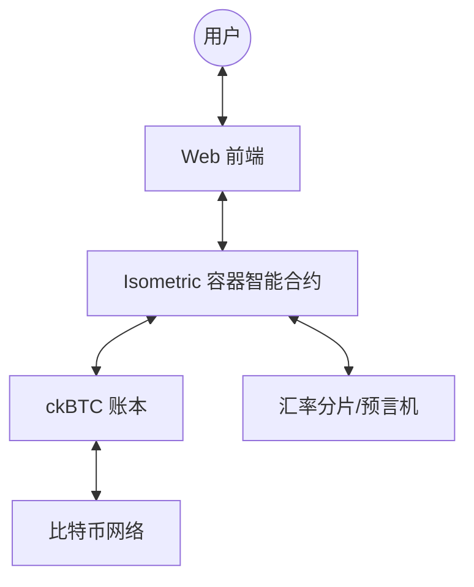

# 架构概览

Isometric 是一个构建在 [Internet Computer (IC)](https://internetcomputer.org/) 之上的去中心化、非托管期权协议。它利用原生比特币集成、阈值密码学（Threshold Cryptography）和链上计算，以实现透明、高效的期权交易。

## 核心支柱

Isometric 的架构设计基于三个核心支柱：

1. **BTC 原生集成**：无需桥接即可直接与比特币网络交互。
2. **确定性结算**：通过预言机和智能合约逻辑实现全自动化、无须许可的结算。
3. **安全与透明**：所有资产和逻辑均在链上运行，消除了对手方风险。

## 系统组件

### 1. 核心容器 (Core Canister)
系统的“大脑”，负责：
- 挂单簿管理（创建、取消、匹配订单）。
- 活跃期权的生命周期管理。
- 触发结算逻辑并计算赔付金额。

### 2. ckBTC 账本 (ckBTC Ledger)
处理所有资金：
- 抵押品锁定。
- 权利金转账。
- 结算赔付分配。
- 代币化比特币的铸造/销毁逻辑。

### 3. 时间触发器 (Timer System)
利用 IC 的全局定时器（Global Timers）自动触发到期事件，无需用户或机器人手动调用结算函数。

### 4. 预言机集成 (Oracle Integration)
使用 IC 汇率分片（Exchange Rate Canister）获取比特币的确定性市场价格，确保结算价格的抗操作性。

## 关键流程

### 订单撮合流程
1. 卖方创建报价，指定行权百分比和权利金。
2. 买方接受报价。
3. 系统将 BTC 行权价锁定为当前价格的 X% 溢价。
4. 权利金从买方转至卖方。
5. 抵押品由的核心容器锁定。

### 到期结算流程
1. 定时器在到期时间触发。
2. 容器通过预言机请求最终结算价格。
3. 根据 [结算公式](/architecture/settlement) 计算内含价值。
4. 资金在账本上自动分配。
5. 合约关闭。

## 深入了解

- **[抵押品系统](/architecture/collateral-system)** - 了解我们如何处理备兑看涨期权。
- **[结算机制](/architecture/settlement)** - 详细了解具体的赔付逻辑。
- **[费用结构](/architecture/fees)** - 了解平台如何盈利及成本分布。
- **[身份验证](/architecture/authentication)** - 深入了解基于比特币签名的非托管账户系统。
