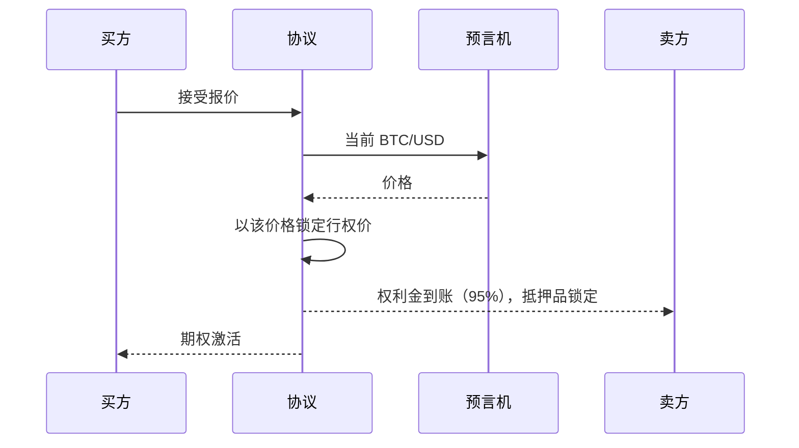
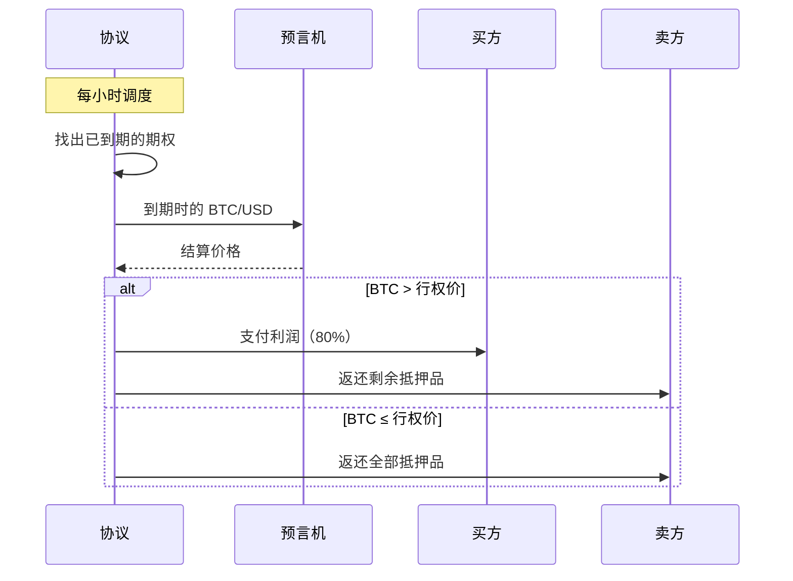

# 机制

期权从报价到结算的全过程。

## 报价被接受时

当买方接受卖方的报价时，三件事一起发生：

- 买方支付权利金。
- 卖方立即获得权利金的 95%，记入可用余额。
- 等额的卖方 BTC 被锁定为抵押品，直到到期。

行权价在创建报价时设置为百分比，会在这一刻使用当前 BTC/USD 价格转换为具体的美元数额，并在期权的整个生命周期内固定不变。

## 结算

结算按固定时间表自动运行。协议查找已到期的期权，从链上预言机获取到期时的 BTC/USD 价格，并向双方支付。

如果支付中途失败，协议会持续重试直到完成。你的余额不会面临风险；期权直到转账完成都由相同的锁定抵押品支撑。

## 关于比特币托管

存款时，你的 BTC 进入由阈值 ECDSA 控制的托管——互联网计算机的节点集体签署比特币交易，单个节点不持有密钥。其内部链上表示称为 ckBTC。从你的角度看，余额表现得就像原生 BTC：你存入 BTC，提取 BTC。

链上查验：[ckBTC 铸造容器](https://dashboard.internetcomputer.org/canister/mqygn-kiaaa-aaaar-qaadq-cai)、[ckBTC 账本容器](https://dashboard.internetcomputer.org/canister/mxzaz-hqaaa-aaaar-qaada-cai)。背景资料：[ckBTC 文档](https://docs.internetcomputer.org/defi/chain-key-tokens/ckbtc/overview)。
