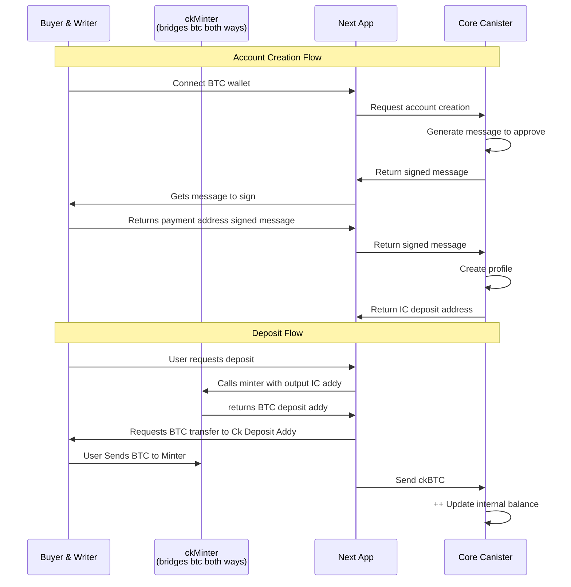
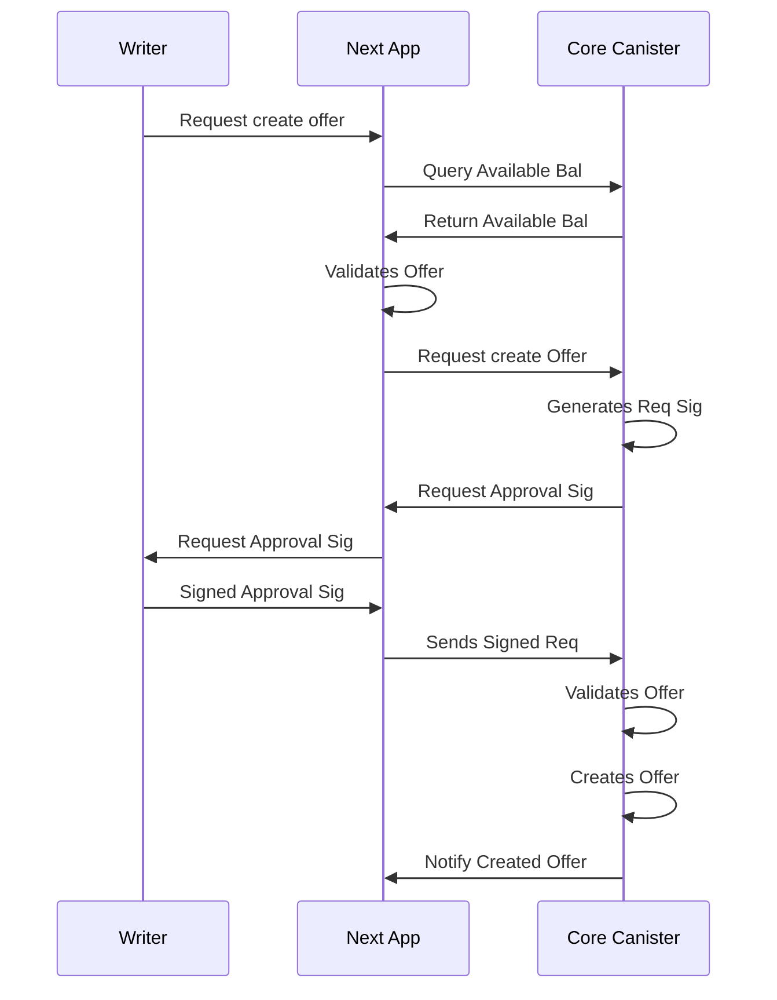
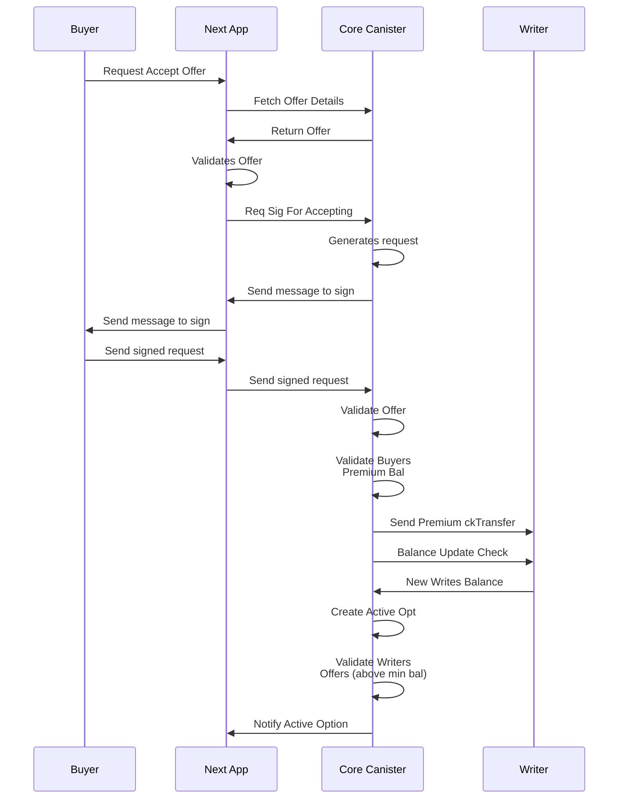
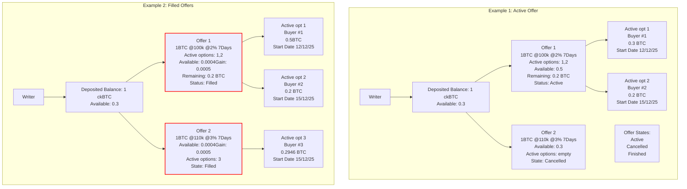
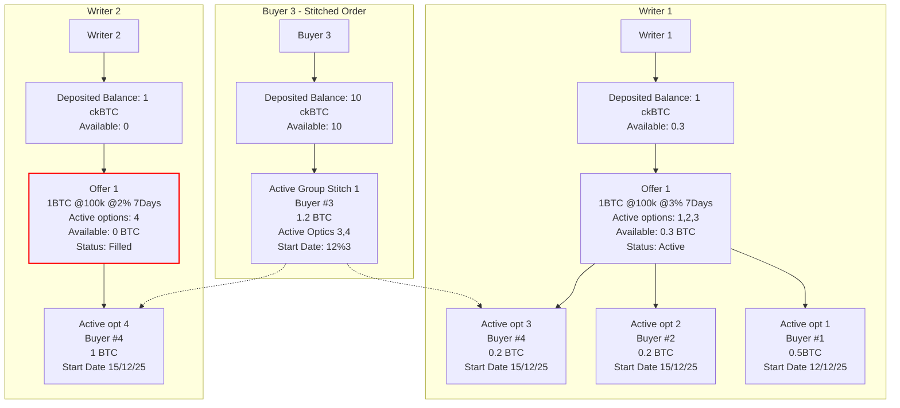

# System Diagrams

## Account Creation/Deposit Flow

## Create Offer Flow

## Accept Offer Flow

## Partial Fills - Data Structure

This diagram illustrates how a writer's deposited balance is allocated across offers and active options, showing the relationship between deposited balance, available balance, offers, and active options.

## Offer Stitching - Data Structure (Future Feature)

This diagram illustrates how a large buyer order can be "stitched" together from multiple writers' offers. When a buyer wants to purchase more than a single writer can provide, the system automatically combines multiple offers to fulfill the order.

